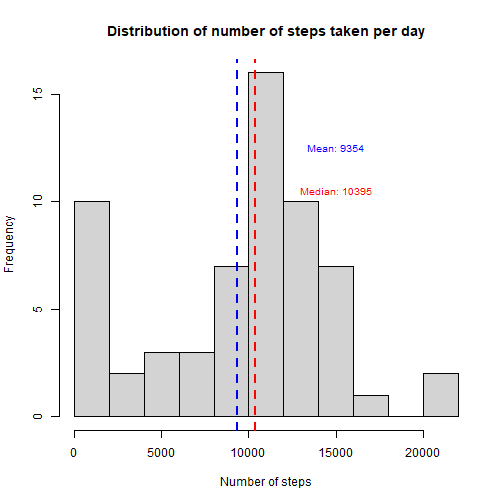
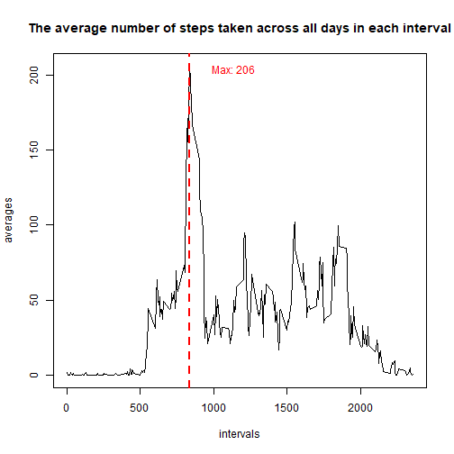
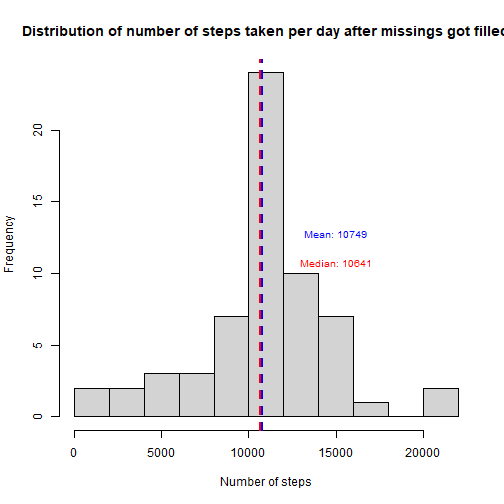
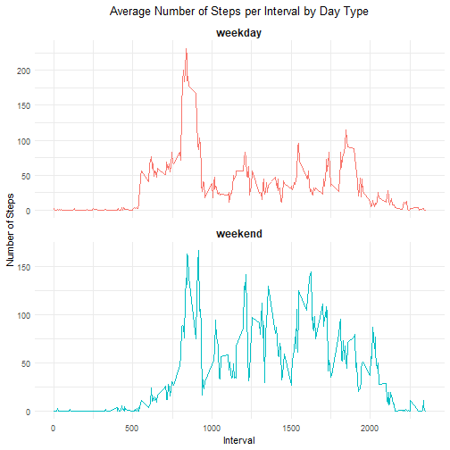

## Loading and preprocessiong the data


``` r
unzip("activity.zip",exdir = "./")
activity <- read.csv("activity.csv")
head(activity)
```

```
##   steps       date interval
## 1    NA 2012-10-01        0
## 2    NA 2012-10-01        5
## 3    NA 2012-10-01       10
## 4    NA 2012-10-01       15
## 5    NA 2012-10-01       20
## 6    NA 2012-10-01       25
```

``` r
str(activity)
```

```
## 'data.frame':	17568 obs. of  3 variables:
##  $ steps   : int  NA NA NA NA NA NA NA NA NA NA ...
##  $ date    : chr  "2012-10-01" "2012-10-01" "2012-10-01" "2012-10-01" ...
##  $ interval: int  0 5 10 15 20 25 30 35 40 45 ...
```

## What is mean total number of steps taken per day?


``` r
library(dplyr)
steps_per_day <- activity %>%
    group_by(date) %>%
    summarise(num_steps = sum(steps, na.rm = TRUE))
mean_steps = mean(steps_per_day$num_steps)
median_steps = median(steps_per_day$num_steps)
hist(steps_per_day$num_steps,breaks = 10, main = "Distribution of number of steps taken per day", xlab = "Number of steps")
abline(v = mean(steps_per_day$num_steps), col = "blue", lwd = 2, lty = 2)
abline(v = median(steps_per_day$num_steps), col = "red", lwd = 2, lty = 2)
text(15000, 12, labels = paste("Mean:", as.integer(round(mean_steps, 2))), pos = 3, col = "blue", cex = 0.8)
text(15000, 10, labels = paste("Median:", as.integer(round(median_steps, 2))), pos = 3, col = "red", cex = 0.8)
```



* The mean total number of steps per day is **9354**.

* The median total number of steps per day is **10395**.


## What is the average daily activity pattern ? 


``` r
avg_num_steps_per_interval <- activity %>%
    group_by(interval) %>%
    summarise(avg_steps = mean(steps,na.rm = TRUE))
max_interval = avg_num_steps_per_interval[which.max(avg_num_steps_per_interval$avg_steps),]$interval
plot(avg_num_steps_per_interval$interval, avg_num_steps_per_interval$avg_steps,
     type = "l", main = "The average number of steps taken across all days in each interval", xlab = "intervals", ylab = "averages")
abline(v = max_interval, col = "red", lwd = 2, lty = 2)
text(max_interval+300,max(avg_num_steps_per_interval$avg_steps)-2, labels = paste("Max:", as.integer(max(avg_num_steps_per_interval$avg_steps))), col = "red")
```



* Across all the days in the dataset, **835th interval** contains the maximum number of steps on average, which is **206**.


## Imputing missing values


``` r
sum(is.na(activity))
```

```
## [1] 2304
```

``` r
x <- merge(activity, avg_num_steps_per_interval, by = "interval")
x[which(is.na(x$steps)),2] <- x[which(is.na(x$steps)),4]
activity2 <- x[,c(1,2,3)]
activity2[,2] <- as.integer(activity2[,2])
sum(is.na(activity2))
```

```
## [1] 0
```

``` r
steps_per_day2 <- activity2 %>%
    group_by(date) %>%
    summarise(num_steps = sum(steps, na.rm = TRUE))
mean_steps = mean(steps_per_day2$num_steps)
median_steps = median(steps_per_day2$num_steps)
hist(steps_per_day2$num_steps,breaks = 10, main = "Distribution of number of steps taken per day after missings got filled", xlab = "Number of steps")
abline(v = mean(steps_per_day2$num_steps), col = "blue", lwd = 2, lty = 2)
abline(v = median(steps_per_day2$num_steps), col = "red", lwd = 2, lty = 2)
text(15000, 12, labels = paste("Mean:", as.integer(round(mean_steps, 2))), pos = 3, col = "blue", cex = 0.8)
text(15000, 10, labels = paste("Median:", as.integer(round(median_steps, 2))), pos = 3, col = "red", cex = 0.8)
```



* There are a total of **2304** missing values in *activity* dataset and these only belong to steps column. We imputed them using averages across intervals and created a new dataset as *activity2*.

* After imputation both mean and median increased and the distribution became more normal.


## Are there differences in activity patterns between weekdays and weekends?


``` r
week_days = c("Monday", "Tuesday","Wednesday","Thursday","Friday")
activity2 <- activity2 %>%
    mutate(day_type = factor(ifelse(weekdays(as.Date(date)) %in% week_days, "weekday","weekend")))
library(ggplot2)
avg_num_steps_per_interval2 <- activity2 %>%
    group_by(interval, day_type) %>%
    summarise(avg_steps = mean(steps,na.rm = TRUE))
g <- ggplot(avg_num_steps_per_interval2, aes(x = interval, y = avg_steps, color = day_type))
g + geom_line() + facet_wrap(~ day_type, ncol = 1, scales = "free_y") +
  labs(title = "Average Number of Steps per Interval by Day Type",
       x = "Interval",
       y = "Number of Steps") +
  theme_minimal() +
  theme(strip.text = element_text(face = "bold", size = 12),
        plot.title = element_text(hjust = 0.5),
        legend.position = "none")
```



* The average number of steps across intervals follows a similar pattern on both weekdays and weekends, with generally higher averages on weekends.

